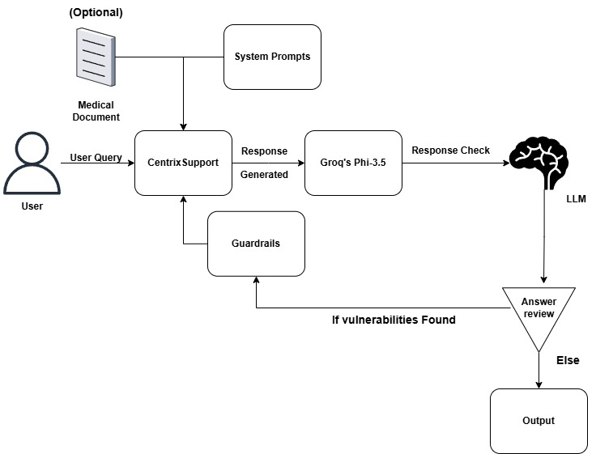

# WealthWise - Spreading financial literacy and economics

WealthWise is an AI chatbot designed to generate innovative solutions for financial literacy and economic education in communities. It's goal is to help users develop creative, practical, and impactful projects that spread financial awareness.

## Problem Statement
Create an innovative project, product, business, or idea that would help spread awareness about financial literacy and economics in the community.

## Project Overview

- **Frontend**: Developed in React to provide a responsive and interactive interface.
- **Backend**: Built with Flask to handle user requests, process inputs, and return AI-based responses.
- **Model**: Utilizes the Gqor Large Language Model (LLM) to process and generate contextually relevant answers to user queries.

## Working Flow of the Project



## Key Features

- **Reasonable Responses**: The chatbot delivers responses that are innovative solutions and can make a real difference in financial literacy.
- **Coping Mechanisms**: Offers specific techniques and practices to manage financial and economic resources.
- **Professional Resources**: Provides sources and guides.

## File Structure

- **src/** - Contains the React frontend files.
- **app.py** - Flask backend for managing requests between the frontend and Gqor LLM model.
- **models/** - Directory for machine learning model files.
- **static/** - Static files like CSS, JavaScript, and images.
- **templates/** - HTML templates used by Flask.

## Getting Started

### Prerequisites

- Node.js
- Python 3
- Flask and other required Python libraries (install via `requirements.txt`)
- React dependencies (install via `package.json`)

### Installation

 **Clone the repository**:
   ```bash
   git clone https://github.com/AbhinavKaintura/WealthWise.git
   cd WealthWise
```
This command installs all necessary Python packages for the backend, as listed in the requirements.txt file.
   ```bash
   cd src
   pip install -r requirements.txt

   ```
This command launches the Flask backend server. Once started, the server listens for incoming requests from the frontend and handles them by processing user inputs and generating AI-based responses. The Flask application also connects with the LLM to deliver contextually relevant answers to user queries.
   ```bash
   python flask_main.py
   ```

This command installs all necessary Node.js dependencies for the frontend, as specified in the package.json file
   ```bash
   npm install
   ```

This command starts the React development server, allowing you to run and test the chatbot interface in your browser. The frontend connects with the backend Flask server, enabling a seamless user experience as the chatbot processes and responds to user messages in real time.
   ```bash
   npm start

